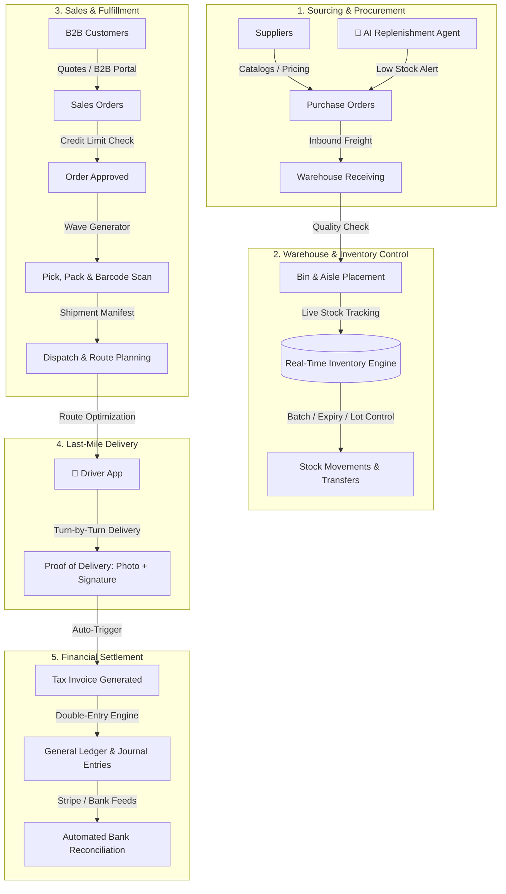
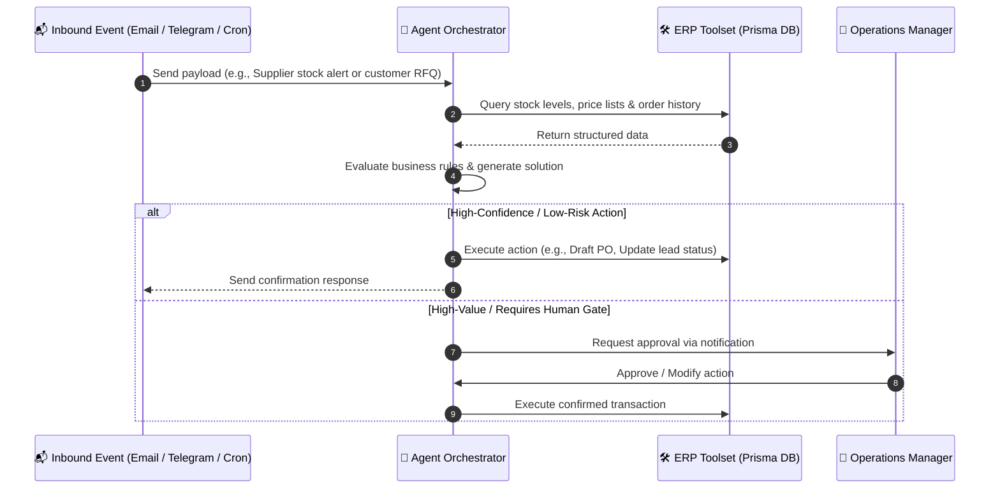

<div align="center">

# 📦 SUPPLY SURE OS
### *The Autonomous AI-Native ERP & Intelligent Supply Chain Operating System*

[](https://nextjs.org/)
[](https://react.dev/)
[](https://www.typescriptlang.org/)
[](https://tailwindcss.com/)
[](https://www.prisma.io/)
[](https://sdk.vercel.ai/)
[](#license)

<p align="center">
  <b>An end-to-end enterprise platform combining multi-warehouse distribution, autonomous AI procurement agents, real-time logistics dispatch, mobile driver proof-of-delivery, and automated double-entry accounting.</b>
</p>

[Overview](#-overview) •
[How It Works](#-how-it-works) •
[System Architecture](#-system-architecture) •
[Core Capabilities](#-core-capabilities) •
[Autonomous AI Agents](#-autonomous-ai-agents) •
[Driver Mobile App](#-driver-mobile-app) •
[Quickstart](#-quickstart) •
[Configuration](#-configuration) •
[RBAC Security](#-role-based-access-control-rbac)

---

</div>

## 🌐 Overview

**SupplySure OS** is an AI-first Enterprise Resource Planning (ERP) and supply chain distribution engine. Designed for wholesale distributors, manufacturers, and multi-location logistics hubs, SupplySure OS replaces fragmented software silos by connecting every stage of the business lifecycle:

- **Procurement & Supplier Relations**: Dynamic PO generation, automated quote comparison, supplier scorecards.
- **Multi-Warehouse Inventory**: Real-time stock levels, bin/aisle tracking, lot & expiry control, wave picking.
- **Fulfillment & Last-Mile Logistics**: Route optimization, live fleet tracking, digital Proof of Delivery (POD) via dedicated driver PWA.
- **Autonomous Agent Layer**: Multi-channel AI agents operating on cron schedules and webhooks to triage inbound emails, forecast demand, and execute low-stock reorders.
- **Financial Ledger & Compliance**: Full double-entry bookkeeping (Chart of Accounts, journal entries, balance sheets), automated invoicing, and dual-jurisdiction tax localization (**Australia ATO/GST** and **India GST/e-Invoice**).

---

## 🔄 How It Works

SupplySure OS coordinates business operations through an interconnected, event-driven pipeline:



---

## 🏛 System Architecture

SupplySure OS is built with a modern decoupled architecture:

```text
┌─────────────────────────────────────────────────────────────────────────┐
│                           CLIENT APPLICATIONS                           │
├───────────────────────────────────┬─────────────────────────────────────┤
│  🖥️  SupplySure Core ERP (Web)    │  📱 Driver Mobile PWA               │
│      Next.js 16 App Router        │     (apps/driver-app on Port 3001)  │
│      Tailwind CSS 4 + shadcn/ui   │     Signature & Camera Hardware APIs│
└─────────────────┬─────────────────┴──────────────────┬──────────────────┘
                  │                                    │
                  │ HTTP / Server Actions              │ Server-Side Proxy
                  ▼                                    ▼
┌─────────────────────────────────────────────────────────────────────────┐
│                    API GATEWAY & SECURITY LAYER                         │
├─────────────────────────────────────────────────────────────────────────┤
│  • RBAC Authorization Gate (src/lib/permissions.ts)                     │
│  • Session Encryption (HMAC-SHA256 Signed Tokens)                       │
│  • Request Rate Limiting & Input Validation (Zod Schemas)               │
└───────────────────────────────────┬─────────────────────────────────────┘
                                    │
    ┌───────────────────────────────┴───────────────────────────────┐
    ▼                                                               ▼
┌───────────────────────────────┐       ┌─────────────────────────────────┐
│   CORE BUSINESS SERVICES      │       │     AI AGENT ORCHESTRATOR       │
├───────────────────────────────┤       ├─────────────────────────────────┤
│ • Inventory & Bin Engine      │       │ • Vercel AI SDK Core Integration│
│ • Order Fulfillment & Routing │       │ • Local Inference (Ollama/Muse) │
│ • Double-Entry Accounting     │       │ • Inbound Email & Telegram Bots │
│ • PDF Generator (@react-pdf)  │       │ • Scheduled Cron Triggers       │
└───────────────┬───────────────┘       └────────────────┬────────────────┘
                │                                        │
                └───────────────────┬────────────────────┘
                                    ▼
┌─────────────────────────────────────────────────────────────────────────┐
│                        DATA PERSISTENCE LAYER                           │
├─────────────────────────────────────────────────────────────────────────┤
│  • Prisma ORM v6.11 (2,800+ lines schema, 50+ relational entities)      │
│  • SQLite (Development) / PostgreSQL (Production)                       │
│  • File Storage: Local filesystem / S3-compatible Blob storage          │
└─────────────────────────────────────────────────────────────────────────┘
```

---

## ⚡ Core Capabilities

### 1. Multi-Warehouse & Inventory Engine
- **Granular Location Hierarchy**: Track stock at Warehouse $\rightarrow$ Zone $\rightarrow$ Aisle $\rightarrow$ Shelf $\rightarrow$ Bin level.
- **Stock Classifications**: On Hand, Allocated/Committed, In-Transit, Safety Stock, and Damaged.
- **Traceability**: Complete audit trails for lot numbers, serial numbers, and expiry tracking with automated FIFO/FEFO pick suggestions.
- **Transfers & Adjustments**: Structured inter-warehouse transfer orders with departure and receiving sign-offs.

### 2. Autonomous AI Agents & Supply Chain Co-Pilot
- **Autonomous Replenishment**: Continuously monitors velocity, lead times, and minimum order quantities (MOQs) to auto-draft purchase orders.
- **Omnichannel Agent Triage**: Connects to Telegram bots and inbound SMTP servers to automatically answer order status queries, parse inbound RFQs, and alert operations.
- **Multi-Model Support**: Switch seamlessly between local on-premise models (Ollama, Muse Glimmer) or managed cloud models (Claude, OpenAI).

### 3. Last-Mile Logistics & Route Optimization
- **Dynamic Route Dispatch**: Group delivery stops into optimal multi-drop routes with vehicle capacity constraints.
- **Driver Mobile Experience (`apps/driver-app`)**:
  - Live stop lists with customer contact details and navigation integration.
  - Photo upload for delivery confirmation.
  - Interactive HTML5 canvas for customer signature capture.
  - Instant synchronization with core ERP order statuses.

### 4. Double-Entry Accounting & Financial Management
- **Full General Ledger**: Customizable Chart of Accounts (Assets, Liabilities, Equity, Revenue, COGS, Expenses).
- **Automated Journal Entries**: Automatic ledger balancing triggered by sales delivery, inventory shrinkage, purchase receiving, and cash receipts.
- **Invoice & Quote Engine**: Professional PDF generation powered by `@react-pdf/renderer` with support for custom terms, payment links, and localized tax formats.
- **Bank Feeds & Reconciliation**: Session-based reconciliation engine matching bank statement lines against ERP invoices and payments.

### 5. Dual-Jurisdiction Localization
| Country | Tax Engine | Banking & IDs | Document Compliance |
|---|---|---|---|
| **🇦🇺 Australia** | 10% GST, Tax Exemption codes | ABN / ACN validation, BSB & Account Number format | ATO-compliant Tax Invoices with Recipient Created Tax Invoice (RCTI) support |
| **🇮🇳 India** | CGST, SGST, IGST multi-slab calculation | GSTIN, PAN, TAN, CIN validation, IFSC & UPI ID format | e-Invoice formatting, HSN/SAC code tracking |

---

## 🤖 Autonomous AI Agents

SupplySure OS embeds intelligent agents directly into operational workflows:



---

## 📱 Driver Mobile App

Located in `apps/driver-app/`, the driver interface is a dedicated, responsive PWA:

- **Isolated Sub-App**: Runs independently on port `3001` with optimized touch-friendly UI.
- **Secure Server-Side Proxy**: Connects to the Core ERP API via server-side routing to eliminate CORS issues across domains.
- **Hardware Integration**:
  - 📷 Direct device camera access for proof-of-delivery photos.
  - ✍️ Touch signature capture pad with PNG export.
  - 🗺️ One-tap deep linking to Apple Maps / Google Maps.

---

## 🚀 Quickstart

### Prerequisites
- **Node.js**: v18.18+ or v20+
- **Git**

### Installation

```bash
# 1. Clone the repository
git clone https://github.com/Mysterio6193/AI-ERP-.git
cd AI-ERP-

# 2. Install dependencies for all apps
npm install
cd apps/driver-app && npm install && cd ../..

# 3. Setup environment variables
cp .env.example .env

# 4. Initialize database schema
npm run db:push
npm run db:generate

# 5. Start development servers
npm run dev          # Starts Core ERP on http://localhost:3000
npm run dev:driver   # Starts Driver App on http://localhost:3001
```

> [!TIP]
> In local development, `AUTH_BYPASS="true"` in `.env` lets you explore all screens without entering credentials.

---

## ⚙️ Configuration

Key environment parameters in `.env`:

| Variable | Description | Default / Example |
|---|---|---|
| `DATABASE_URL` | Prisma database connection string | `file:./db/dev.db` |
| `ADMIN_SESSION_SECRET` | Session signing secret (Core app) | Generate with `openssl rand -base64 48` |
| `DRIVER_SESSION_SECRET`| Session signing secret (Driver app) | Generate with `openssl rand -base64 48` |
| `AUTH_BYPASS` | Skip authentication gates in dev | `true` (dev only) |
| `AGENT_PROVIDER` | LLM runtime provider | `local` or `gateway` |
| `AGENT_LOCAL_BASE_URL` | Local OpenAI-compatible endpoint | `http://localhost:11434/v1` |
| `CORE_APP_URL` | Core ERP URL for driver app proxy | `http://localhost:3000` |
| `STRIPE_SECRET_KEY` | Stripe integration API key | `sk_test_...` |

---

## 🛡️ Role-Based Access Control (RBAC)

SupplySure OS enforces granular security across all backend API routes and UI views:

| Role | Dashboard | Inventory | Orders & Quotes | Logistics & Routes | Finance & Ledger | AI & Settings |
|---|:---:|:---:|:---:|:---:|:---:|:---:|
| **ADMIN / EXECUTIVE** | ✅ Full | ✅ Full | ✅ Full | ✅ Full | ✅ Full | ✅ Full |
| **OPERATIONS** | ✅ Full | ✅ Full | ✅ Full | ✅ Full | 👁️ Read-Only | 👁️ View |
| **WAREHOUSE** | 👁️ View | ✅ Full | 📦 Pick/Pack | 📦 Dispatch | ❌ No Access | ❌ No Access |
| **SALES** | 👁️ View | 👁️ Read-Only | ✅ Full | 👁️ Read-Only | 👁️ Quotes/Invoices | ❌ No Access |
| **ACCOUNTS** | 👁️ View | ❌ No Access | 👁️ Read-Only | ❌ No Access | ✅ Full | ❌ No Access |
| **DRIVER** | ❌ No Access | ❌ No Access | ❌ No Access | 📱 Driver PWA | ❌ No Access | ❌ No Access |

---

## 🧪 Testing & Quality Assurance

```bash
# Run the test suite
npm run test

# Run tests in interactive watch mode
npm run test:watch

# Typecheck driver app
npm run typecheck:driver

# Lint codebase
npm run lint
```

---

## 📄 License

This repository is private and proprietary. Unauthorized distribution, copying, or modification is strictly prohibited.

